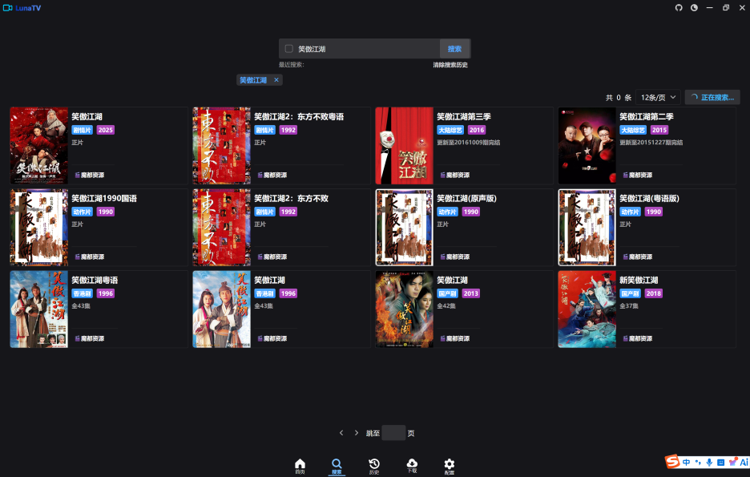
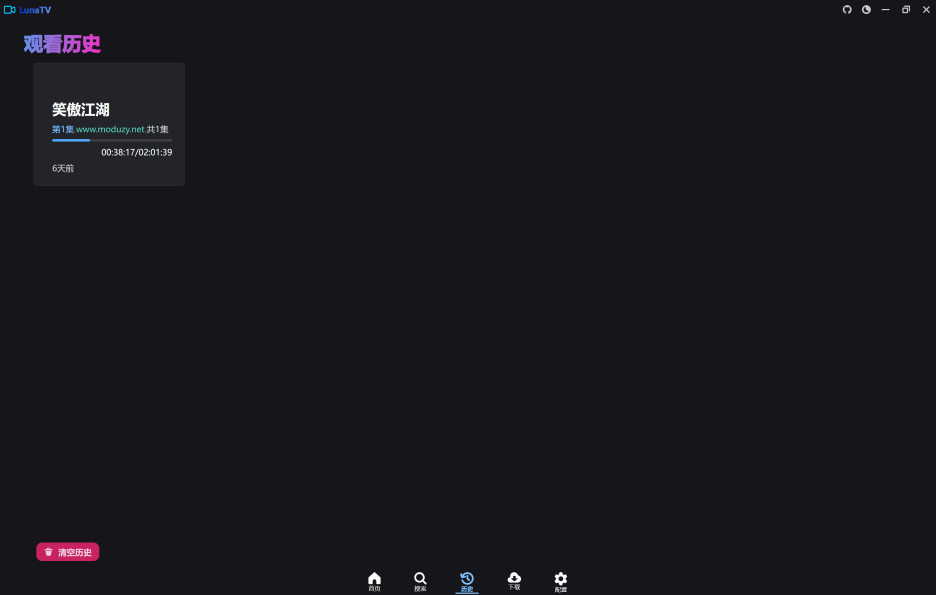
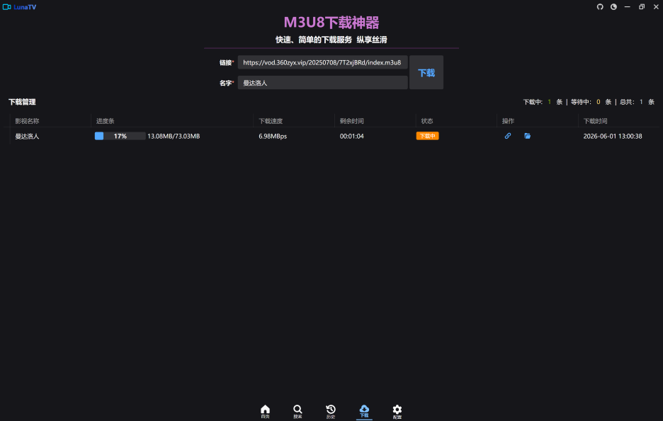
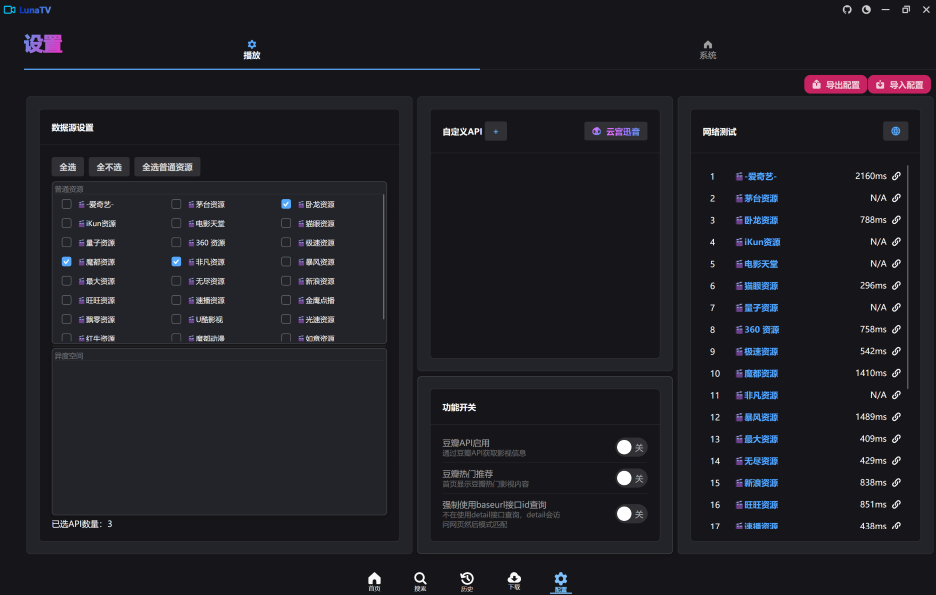

# LuanTV

站在巨人的肩膀

- [LibreTV](https://github.com/LibreSpark/LibreTV)
- [LibreTV-App](https://github.com/KeyRotate/LibreTV-App)

# Mac食用指南

安装 `brew install mpv`

会同时安装ffmpeg。

# 搜索界面

## 历史界面

## 设下载面

## 设置界面

